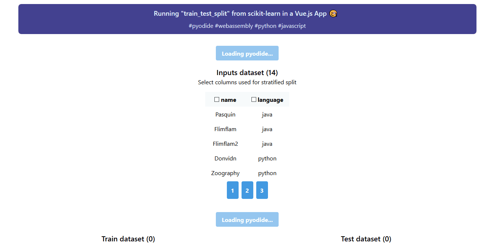

# Pyodide Vue.js App example

Run "train_test_split" from [scikit-learn](http://scikit-learn.org/stable/modules/generated/sklearn.model_selection.train_test_split.html) in a [Vue.js](https://vuejs.org/) App using [Pyodide](https://github.com/iodide-project/pyodide).



For more information on Pyodide, checkout this [mozilla blog post](https://hacks.mozilla.org/2019/04/pyodide-bringing-the-scientific-python-stack-to-the-browser/).

## Project setup

```
yarn install
```

### Compiles and hot-reloads for development

```
yarn serve
```

### Compiles and minifies for production

```
yarn build
```

### Lints and fixes files

```
yarn lint
```

### Test

```
yarn test
```
