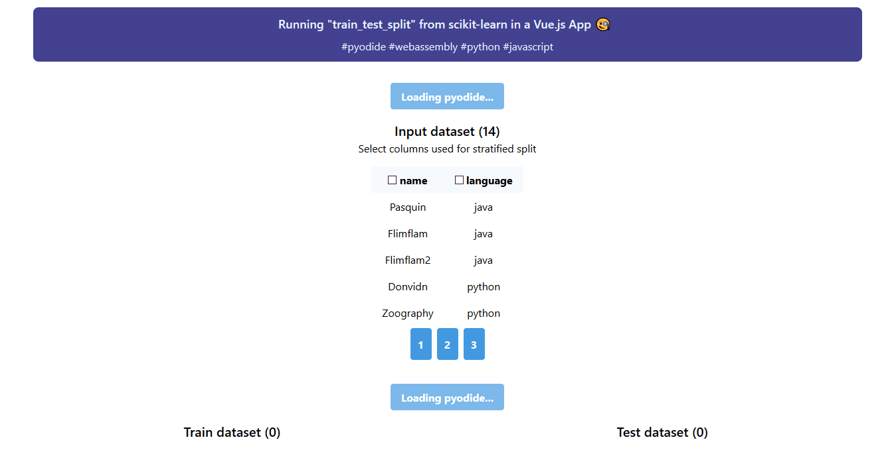

# Pyodide Vue.js App example

Run "train_test_split" from [scikit-learn](http://scikit-learn.org/stable/modules/generated/sklearn.model_selection.train_test_split.html) in a [Vue.js](https://vuejs.org/) App using [Pyodide](https://github.com/iodide-project/pyodide).



For more information on Pyodide, checkout this [mozilla blog post](https://hacks.mozilla.org/2019/04/pyodide-bringing-the-scientific-python-stack-to-the-browser/).

## Project setup

```sh
npm install
```

### Compile and Hot-Reload for Development

```sh
npm run dev
```

### Type-Check, Compile and Minify for Production

```sh
npm run build
```

### Run End-to-End Tests with [Playwright](https://playwright.dev)

```sh
# Install browsers for the first run
npx playwright install

# When testing on CI, must build the project first
npm run build

# Runs the end-to-end tests
npm run test
```

### Lint with [ESLint](https://eslint.org/)

```sh
npm run lint
```
